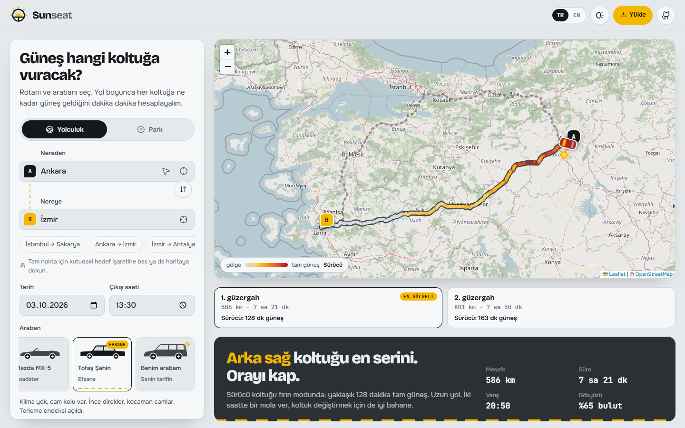
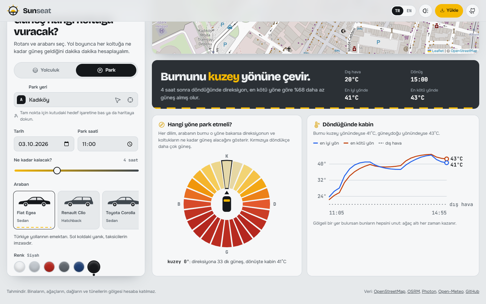
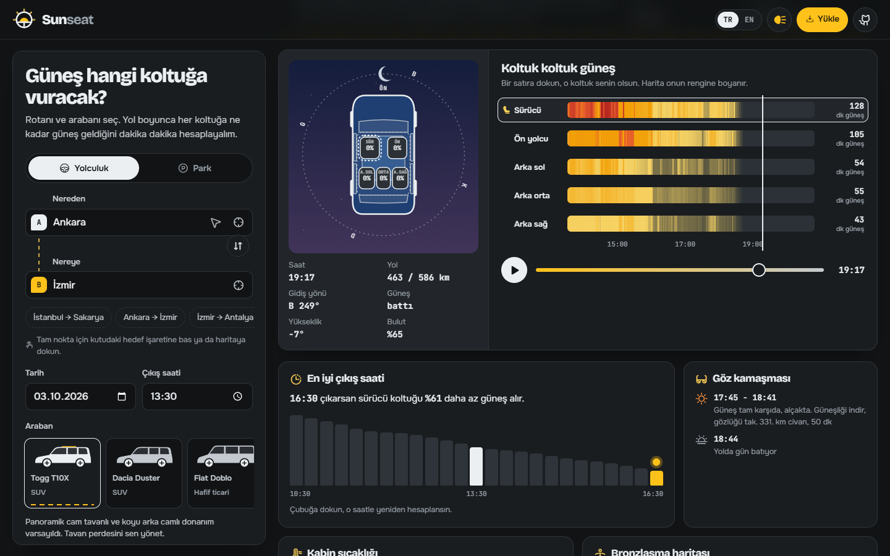

<div align="center">


# Sunseat

**Güneş hangi koltuğa vuracak?** Rotanı, çıkış saatini ve arabanı seç; yol boyunca her koltuğa ne kadar güneş geldiğini dakika dakika gör.

[](https://cafu1107.github.io/sunseat/)
[](LICENSE)


[**Siteyi aç**](https://cafu1107.github.io/sunseat/) · [English](#english)



</div>

## Ne yapıyor?

İstanbul'dan Sakarya'ya 15:30'da çıkıyorsun. Güneş hangi koltuğa vuracak, sürücü mü yanacak, arkadakiler mi? Sunseat rotayı yüzlerce kısa parçaya bölüyor. Her parçada arabanın yönünü güneşin konumuyla karşılaştırıyor ve ışığın hangi camdan, ne açıyla girdiğini hesaplıyor.

| | |
|---|---|
| 📍 **Ayrıntılı konum** | Sokak ve kapı numarasıyla arama, "Haritadan seç" modu (haritayı kaydır, iğne tam noktaya otursun), GPS ile konumum, koordinat yapıştırma, son kullanılan yerler. |
| 🗺️ **Harita** | Rota, seçtiğin koltuğun güneş miktarına göre renklenir. Üzerine gel, araba o noktaya gider. |
| 🛣️ **Alternatif rotalar** | 3 güzergaha kadar karşılaştırır, senin koltuğun için **en gölgeli** olanı işaretler. |
| 🅿️ **Park modu** | Arabayı hangi yöne park edersen direksiyon en az güneş alır? 24 yönlü pusula ve döndüğündeki kabin sıcaklığı. |
| 🚗 **Üstten araba** | Güneş arabanın etrafında döner, ışık alan camlar ve koltuklar canlı boyanır. Arkadaki gökyüzü saate göre değişir: öğlen mavi, gün batımında turuncu, gece yıldızlı. ▶ ile yolculuğu oynat. |
| 📊 **Koltuk şeritleri** | 2, 5 ya da 7 koltuğun zaman çizelgesi ve "tam güneş dakikası" toplamı. |
| 🌡️ **Kabin sıcaklığı** | Klima kapalı olsaydı kabin kaç dereceye çıkardı? Araba rengi de hesaba girer (siyah ve beyaz farkı). |
| 🧍 **Bronzlaşma haritası** | Seçtiğin koltukta güneşin vücudunun neresine vurduğunu gösterir, krem önerir. |
| 🍂 **Dört mevsim** | Aynı yol ve saat: ilkbahar, yaz, sonbahar, kış yan yana. |
| ⏰ **En iyi çıkış saati** | ±3 saati tarar: "17:15'te çıkarsan koltuğun %48 daha az güneş alır." |
| 😎 **Göz kamaşması** | Alçak güneş tam karşıdaysa ya da dikiz aynasına vuruyorsa saatini ve kilometresini söyler. |
| 💪 **Şoför kolu endeksi** | Sol ön camdan gelen ışık ve UV ile "kamyoncu kolu" riskini 10 üzerinden puanlar. |
| 👨‍👩‍👧 **Aile modu** | Güneşsever ve gölgecileri koltuklara kavgasız dağıtır. |
| ☁️ **Gerçek hava** | Open-Meteo'dan bulut, UV ve sıcaklık çeker (16 gün ileriye kadar). |
| 🖼️ **Paylaşım kartı** | Sonucu 1080x1350 PNG olarak indir. Bağlantı her ayarı URL'de taşır. |
| ⭐ **Kayıtlı rotalar** | Sık gittiğin rotayı kaydet, tek dokunuşla aç. |
| 🏅 **Rozetler** | 15 gizli rozet: "Gün batımı avcısı", "Gölge ustası", "Şahin sürücüsü"... |
| 📱 **Telefona kurulur** | PWA: ana ekrana ekle, uygulama gibi açılsın. Daha önce baktığın rotalar çevrimdışı da açılır. |

<div align="center"></div>

### Araba modeli neyi değiştiriyor?

Her kasa tipinin ön cam yatıklığı, yan cam yüksekliği, arka cam açısı ve cam alanı farklı. Aynı rotada Fiat Egea ile koyu arka camlı Togg T10X'te en serin koltuk farklı çıkabiliyor.

| Model | Özelliği |
|---|---|
| Fiat Egea, Toyota Corolla | Sedan, eğimli arka cam |
| Renault Clio, Hyundai i20 | Hatchback, dik arka cam |
| Dacia Jogger | 7 koltuk, üçüncü sıra arka camın hemen önünde |
| VW Passat Variant | Station, uzun arka cam |
| Togg T10X | SUV, panoramik cam tavan (perdesi açılıp kapanır), koyu arka camlar |
| Dacia Duster | SUV, yüksek camlar |
| Fiat Doblo | Hafif ticari, kocaman yan camlar |
| Tesla Model Y | Tamamı cam tavan |
| Mazda MX-5 | 2 koltuk, tavan açılınca herkes yanar |
| Tofaş Şahin | Klima yok: **terleme endeksi** açılır, kontak butonu jikle ister |

Listede olmayan araban için **"Benim arabam"** kartıyla kasa tipini, tavanı (metal, panoramik, tam cam, açılır), koltuk sayısını (2/5/7), koyu arka camı ve klimayı kendin seçebilirsin. Cam filmi koyuluğu ve boya rengi de ayarlanabilir.

### Küçük sürprizler

Logoya 5 kez dokun. Farları (tema düğmesini) yak. Şahin'i seç ve kontağı çevir. Aynı yeri iki kez seç. Rozetlerin hepsini toplamaya çalış.

## Nasıl hesaplıyor?

1. **Rota:** [OSRM](https://project-osrm.org), her yol parçasının süresiyle birlikte.
2. **Güneş:** [SunCalc](https://github.com/mourner/suncalc) formülleri, tarayıcıda. Atmosferik kırılma dahil.
3. **Kabin modeli:** Güneş yönü araba koordinatlarına çevrilir. Her cam (ön, 4 yan, arka, tavan) için yüzey normali, geçirgenlik ve tavan kenarı kesmesi hesaplanır. Her camın her koltuğa etkisi bir ağırlık tablosundan gelir. Karşı taraftaki koltuğa ancak alçak güneş ulaşır.
4. **Bulut:** Bulut oranı doğrudan ışığı en fazla %75 azaltır.

5. **Kabin sıcaklığı:** Camlardan giren güneş ve kaportanın renge göre soğurduğu ısı, birinci dereceden bir ısınma modeliyle dış havaya eklenir. Park halinde camlar kapalı, yolda fan açık varsayılır.

Kod: [`model.js`](assets/js/model.js) (ışık modeli), [`sim.js`](assets/js/sim.js) (simülasyon ve analizler), [`cabin.js`](assets/js/cabin.js) (kabin ısısı), [`park.js`](assets/js/park.js) (park yönü), [`tan.js`](assets/js/tan.js) (bronzlaşma), [`cars.js`](assets/js/cars.js) (arabalar).

> **Dürüst sınırlar:** Binaların, ağaçların, dağların ve tünellerin gölgesi hesaba katılmaz. Sonuçlar eğlence amaçlı tahmindir.

## Yerelde çalıştır

Derleme adımı yok. ES modülleri yüzünden bir HTTP sunucusu gerekiyor:

```bash
git clone https://github.com/Cafu1107/sunseat.git
cd sunseat
python -m http.server 8000
# http://localhost:8000
```

## Veri kaynakları

[OpenStreetMap](https://www.openstreetmap.org/copyright) (harita), [OSRM](https://project-osrm.org) (rota), [Photon](https://photon.komoot.io) (adres arama), [Open-Meteo](https://open-meteo.com) (hava). Hepsi ücretsiz ve anahtarsız. Yoğun kullanımda kendi sunucunu kurman önerilir.

## Lisans

[MIT](LICENSE)

---

<a id="english"></a>

## English

**Which seat will the sun hit?** Pick a route, a departure time and your car. Sunseat splits the drive into hundreds of short slices and, for each one, compares the car's heading with the sun's position to work out which window the light comes through, at what angle, and which seat it lands on.



- Route map coloured by the sun on *your* seat, up to 3 alternative routes with the shadiest one marked, and an animated top-down car under a live sky you can scrub or play.
- Precise location picking: street-level search, a fixed-pin "pick on map" mode, GPS and pasted coordinates.
- Per-seat timelines, the best departure time within ±3 hours, glare warnings, cabin temperature (paint colour matters), a tan map, a four-season comparison, a "trucker arm" index, family seating mode, saved routes, 15 hidden badges and a share card.
- **Park mode:** which way should the nose point so the steering wheel stays coolest, and how hot the cabin will be when you return.
- Installable as a PWA; routes you viewed before still open offline.
- Car models matter: windscreen rake, window height, rear glass angle, privacy glass, panoramic or all-glass roofs, 7-seaters, a roadster with the top down, a Tofaş Şahin with no AC (sweat index unlocked), or describe your own car.
- Real cloud, UV and temperature from Open-Meteo.
- Plain HTML, CSS and JS plus Leaflet. No build step, no API keys. Turkish and English.

Shade from buildings, trees, mountains and tunnels is not modelled. Treat the numbers as a fun estimate.

Run locally with any static server (`python -m http.server`). MIT licensed.
